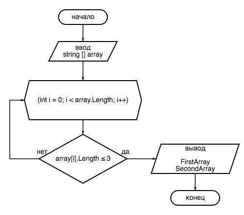

## Итоговая проверочная работа.

# Задачи :
1. Создать репозиторий на GitHub
2. Нарисовать блок-схему алгоритма (можно обойтись блок-схемой основной содержательной части, если вы выделяете ее в отдельный метод)
3. Снабдить репозиторий оформленным текстовым описанием решения (файл README.md)
4. Написать программу, решающую поставленную задачу
5. Использовать контроль версий в работе над этим небольшим проектом (не должно быть так что все залито одним коммитом, как минимум этапы 2, 3 и 4 должны быть расположены в разных коммитах)
6. **Задача** Написать программу, которая из имеющегося массива строк формирует массив из строк, длина которых меньше либо равна 3 символа. Первоначальный массив можно ввести с клавиатуры, либо задать на старте выполнения алгоритма. При решение не рекомендуется пользоваться коллекциями, лучше обойтись исключительно массивами.

**Примеры**:

["hello", "2", "world", ":-)"] -> ["2", ":-)"]

["1234", "1567", "-2", "computer science"] -> ["-2"]

["Russia", "Denmark", "Kazan"] -> []

# Описание алгоритма решения:

- Создаём массив с возможностью ввода пользователем количества элементов массива.

- Наполняем массив элементами, которые пользователь вводит с консоли.

- Выводим на экран введённый пользователем массив.

- Находим в исходном массиве элементы, количество символов в которых не привышает 3, и выводим их на экран.

## Изображение

